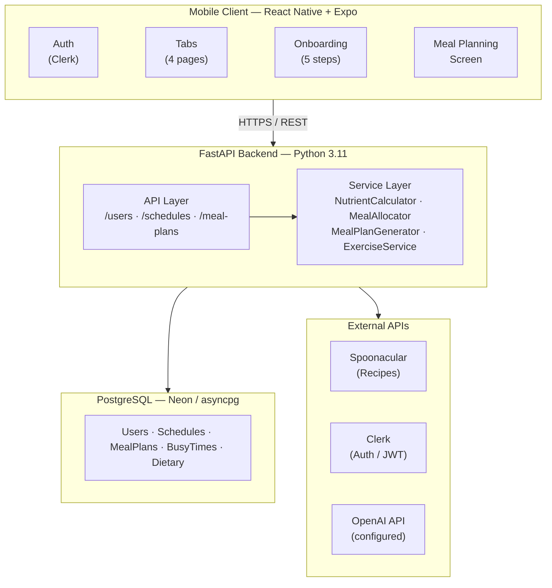
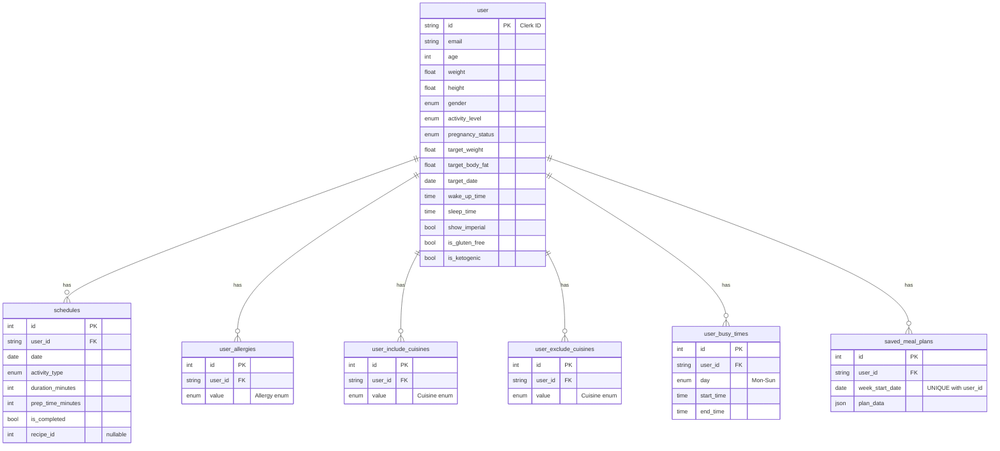
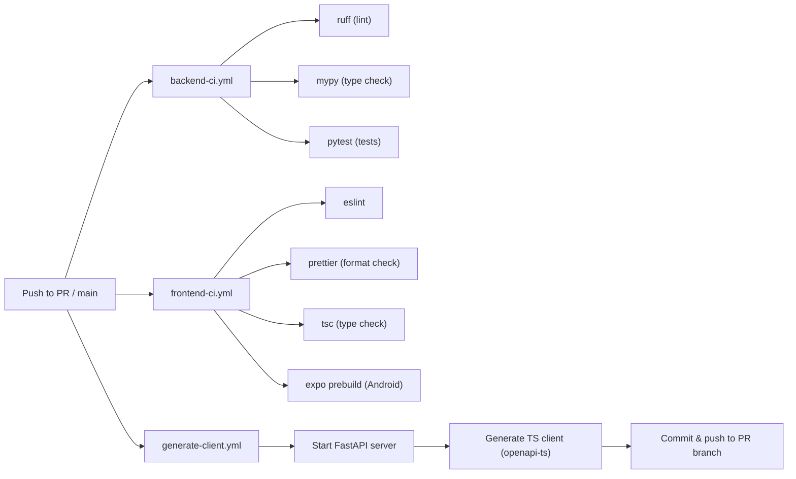

# Sophros Architecture Document

LAST UPDATED: 03/09/2026 by Eduard Tanase

## Overview

Sophros is a health planning mobile application that collects lifestyle data (nutrition, sleep, exercise, schedule) and generates personalized meal plans, workout schedules, and health insights. The system consists of a React Native mobile frontend and a Python/FastAPI backend, backed by a PostgreSQL database and third-party APIs.

---

## System Architecture



---

## Technology Stack

### Frontend

| Technology           | Version    | Purpose                                      |
| -------------------- | ---------- | -------------------------------------------- |
| React Native         | 0.81.5     | Cross-platform mobile framework              |
| Expo                 | 54         | Managed RN workflow, EAS builds              |
| Expo Router          | File-based | Navigation (Stack + Tabs)                    |
| TypeScript           | Strict     | Type safety                                  |
| TanStack React Query | Latest     | Server state, caching, mutations             |
| @clerk/clerk-expo    | Latest     | Authentication UI + token management         |
| lucide-react-native  | Latest     | Icon library                                 |
| expo-secure-store    | Latest     | Encrypted token storage                      |
| @hey-api/openapi-ts  | Latest     | Auto-generate API client from OpenAPI schema |

### Backend

| Technology | Version  | Purpose                             |
| ---------- | -------- | ----------------------------------- |
| FastAPI    | 0.128.7+ | Async REST API framework            |
| Python     | 3.11     | Runtime                             |
| SQLAlchemy | 2.0+     | Async ORM (asyncpg driver)          |
| Alembic    | Latest   | Database migrations                 |
| Pydantic   | 2.12.5+  | Data validation and serialization   |
| HTTPX      | Latest   | Async HTTP client for external APIs |
| uv         | Latest   | Package management                  |
| Ruff       | Latest   | Linting                             |
| mypy       | Latest   | Static type checking                |
| pytest     | Latest   | Testing                             |

### Infrastructure

| Technology                      | Purpose                               |
| ------------------------------- | ------------------------------------- |
| PostgreSQL                      | Primary relational database           |
| Neon                            | Serverless PostgreSQL hosting         |
| GitHub Actions                  | CI/CD (lint, test, type-check, build) |
| EAS (Expo Application Services) | iOS/Android cloud builds              |
| Clerk                           | Identity & Access Management SaaS     |

---

## Backend Architecture

### Layer Breakdown

```
app/
├── main.py            # FastAPI app instantiation, CORS, lifespan
├── api/
│   ├── api.py         # Router registration (v1 prefix)
│   ├── deps.py        # Shared dependencies (Clerk JWT → user_id)
│   └── endpoints/     # Route handlers (thin controllers)
├── services/          # Business logic
├── models/            # SQLAlchemy ORM models
├── schemas/           # Pydantic I/O models
├── db/                # Session factory, Base class
├── domain/            # Enums shared across layers
└── core/              # Settings (env vars)
```

### Authentication Flow

1. Clerk issues JWT on sign-in (RS256 signed).
2. Frontend stores token in `expo-secure-store`.
3. Frontend sends `Authorization: Bearer <token>` on every API request.
4. Backend `deps.py` validates JWT using Clerk's RSA public key.
5. Validated `sub` (Clerk user ID) is passed to route handlers.
6. Routes look up or create the matching `user` row in PostgreSQL.

### API Endpoints

| Method | Path                               | Description                             |
| ------ | ---------------------------------- | --------------------------------------- |
| GET    | `/health`                          | Health check                            |
| POST   | `/api/v1/users`                    | Create user (post-onboarding)           |
| GET    | `/api/v1/users/me`                 | Get current user profile                |
| PUT    | `/api/v1/users/me`                 | Update user profile                     |
| GET    | `/api/v1/users/me/targets`         | Compute DRI nutrient targets            |
| POST   | `/api/v1/schedules`                | Create schedule item                    |
| GET    | `/api/v1/schedules`                | List schedule items (date range filter) |
| PUT    | `/api/v1/schedules/{id}`           | Update schedule item                    |
| DELETE | `/api/v1/schedules/{id}`           | Delete schedule item                    |
| POST   | `/api/v1/meal-plans/generate`      | Generate a single day meal plan         |
| POST   | `/api/v1/meal-plans/generate-week` | Generate a full weekly meal plan        |
| POST   | `/api/v1/meal-plans/save`          | Save/upsert weekly plan                 |
| GET    | `/api/v1/meal-plans/week`          | Get saved plan for a week               |
| GET    | `/api/v1/meal-plans/planned-weeks` | List weeks with saved plans             |

FastAPI auto-generates Swagger docs at `/docs` and `/redoc`.

### Service Layer

**NutrientCalculator** (`services/nutrient_calculator.py`)

- Implements Mifflin-St Jeor BMR equation
- TDEE = BMR × activity multiplier (1.2 to 1.9)
- Macro ranges from AMDR (protein 10–35%, fat 20–35%, carbs 45–65%)
- Calorie offset from weight/body-fat goals and target date (capped ±1000 kcal/day)
- Integrates exercise calorie burn into daily targets

**MealAllocator** (`services/meal_allocator.py`)

- Distributes daily calorie/macro targets across 3 meal slots
  - Breakfast: 30%, Lunch: 35%, Dinner: 35%
- Schedules meal and exercise times within free windows
- Respects `user_busy_times` when assigning slot times

**MealPlanGenerator** (`services/meal_plan.py`)

- Orchestrates weekly plan: exercise planning → daily targets → slot allocation → recipe fetch
- Calls Spoonacular in 2 batches per day (breakfast pool + main course pool)
- Implements leftover logic: cook-for-two sessions paired with reuse slots on busy days

**ExerciseService** (`services/exercise_service.py`)

- Selects cardio vs. weight lifting ratio based on user body composition goals
- Distributes sessions across available weekly time slots
- Estimates calorie burn (cardio: ~10 kcal/min, weights: ~5 kcal/min)

**SpoonacularClient** (`services/spoonacular.py`)

- Wraps `/recipes/complexSearch` endpoint
- Filters by calorie range, macros, dietary restrictions, allergies, cuisine preferences

---

## Frontend Architecture

### Navigation Structure

```
Root Layout (_layout.tsx)
└── Stack Navigator
    ├── (auth)/              # Unauthenticated
    │   ├── sign-in.tsx
    │   └── sign-up.tsx
    ├── onboarding/          # Post-signup, pre-profile
    │   ├── index.tsx        # Step 0: intro
    │   ├── step1.tsx        # Biological data
    │   ├── step2.tsx        # Goals
    │   ├── step3.tsx        # Schedule/sleep
    │   ├── step4.tsx        # Dietary preferences
    │   ├── step5.tsx        # Allergies & cuisines
    │   └── done.tsx         # Completion
    ├── (tabs)/              # Authenticated main app
    │   ├── index.tsx        # Home
    │   ├── schedule.tsx     # Weekly schedule view
    │   ├── progress.tsx     # Progress tracking
    │   └── profile.tsx      # User profile
    ├── week-planning.tsx    # Meal plan generation UI
    ├── health-score.tsx     # Health score breakdown
    └── profile/
        ├── edit.tsx
        └── dietary-preferences.tsx
```

### State Management

**TanStack React Query** handles all server state:

- `useUserQuery()` — fetch/cache user profile
- `useUserTargetsQuery()` — fetch DRI targets
- `useGenerateWeekPlanMutation()` — trigger weekly plan generation
- `useSaveMealPlanMutation()` — persist meal plan
- Query keys follow factory pattern (`userKeys`, `mealPlanKeys`)

**React Context** handles local app state:

- `UserContext` — current user data, `isOnboarded` flag
- `OnboardingProvider` — multi-step form state and validation

**No Redux** — contrary to the design document, Redux is not used.

### API Client

The TypeScript API client (`api/`) is auto-generated from the FastAPI OpenAPI schema via `@hey-api/openapi-ts`. A GitHub Actions workflow regenerates the client on every backend change and commits to the PR branch. This keeps frontend types in sync with backend schemas automatically.

---

## Database Schema



### Migration History

| Migration      | Description                                         |
| -------------- | --------------------------------------------------- |
| `51db8ff87aba` | Initial: `user`, `schedules` tables                 |
| `1f955c767c7e` | Dietary: `user_allergies`, include/exclude cuisines |
| `7314ef4e6209` | Schedule table refinements                          |
| `a1b2c3d4e5f6` | Busy times: `user_busy_times`                       |
| `d2efffbda75e` | Meal plans: `saved_meal_plans`                      |
| `023eaa79cde6` | Schema updates (evan updates)                       |

---

## External Integrations

### Clerk (Authentication)

- RS256 JWT issuance and validation
- OAuth provider support (Google, Apple, etc.)
- Webhook for user lifecycle events

### Spoonacular API (Recipes)

- Endpoint: `GET /recipes/complexSearch`
- Filters: calorie range, macros, diet type, intolerances, cuisine
- Returns: recipe name, image, nutrition summary, ingredient list, instructions
- Used for: meal slot population during plan generation

### OpenAI API (Planned)

- Configured via `OPENAI_API_KEY` in settings
- Not yet integrated into any service or endpoint

---

## CI/CD Pipeline



---

## Key Design Patterns

- **Generated API Client**: Frontend types stay in sync with backend schemas automatically; no manual type duplication.
- **Async Throughout**: SQLAlchemy async sessions + asyncpg + HTTPX async client enable high concurrency.
- **Dependency Injection**: FastAPI `Depends()` provides auth, DB sessions to routes.
- **Pydantic v2 Schemas**: Separate `Create`, `Update`, `Read` schemas per model.
- **Enum-Driven Domain**: All categorical values (activity level, meal slot, cuisine, allergy) defined as enums in `domain/enums.py`, shared across ORM, schemas, and business logic.
