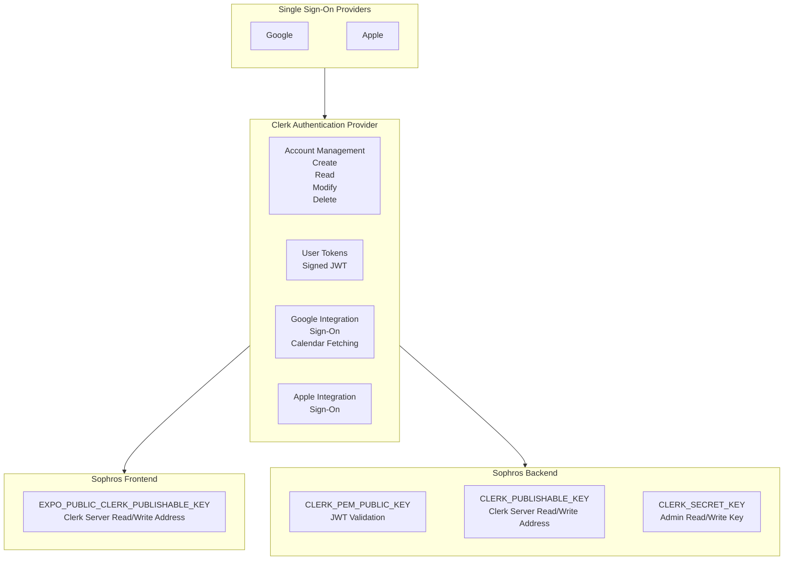

```mermaid
graph TD
    subgraph SingleSign["Single Sign-On Providers"]
        direction LR
        Google["Google"] ~~~ Apple["Apple"]
    end

    SingleSign ---> Clerk

    subgraph Clerk["Clerk Authentication Provider"]
        Account["Account Management<br/>Create<br/>Read<br/>Modify<br/>Delete"]
        Session["User Tokens<br/>Signed JWT"]
        Calendar["Google Integration<br/>Sign-On<br/>Calendar Fetching"]
        AppleI["Apple Integration<br/>Sign-On"]
    end

    Clerk --> Frontend
    Clerk --> Backend

    subgraph Frontend["Sophros Frontend"]
        fUses1["EXPO_PUBLIC_CLERK_PUBLISHABLE_KEY<br/>Clerk Server Read/Write Address"]
    end

    subgraph Backend["Sophros Backend"]
        direction LR
        bUses1["CLERK_PEM_PUBLIC_KEY<br/>JWT Validation"]
        ~~~bUses2["CLERK_PUBLISHABLE_KEY<br/>Clerk Server Read/Write Address"]
        ~~~bUses3["CLERK_SECRET_KEY<br/>Admin Read/Write Key"]
    end
```
