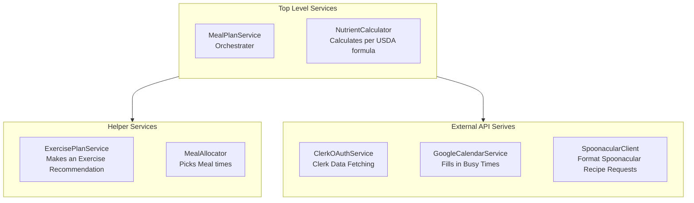

```mermaid
graph TD
    subgraph ExternalServices["Top Level Services"]
        direction LR
        MealPlan["MealPlanService<br/>Orchestrater"] ~~~ Nutrient["NutrientCalculator<br/>Calculates per USDA formula"]
    end

    ExternalServices ---> InternalServices
    ExternalServices ---> APIs

    subgraph InternalServices["Helper Services"]
        direction LR
        Exercise["ExercisePlanService<br/>Makes an Exercise Recommendation"]
        ~~~MealAlloc["MealAllocator<br/>Picks Meal times"]
    end

    subgraph APIs["External API Serives"]
        direction LR
        clerk["ClerkOAuthService<br/>Clerk Data Fetching"]
        ~~~GoogleCalendarService["GoogleCalendarService<br/>Fills in Busy Times"]
        ~~~spoonacular["SpoonacularClient<br/>Format Spoonacular Recipe Requests"]
    end
```
