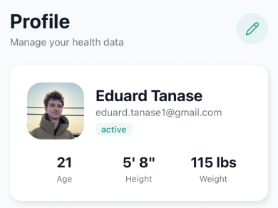

# Manual Test: Clerk Authentication

**Date**: 02.07.26

**Name of the person performing the test**: Eduard

**Test Steps**:

1. Run the application with test Clerk API keys
2. Attempt to sign in with Google OAuth
3. Verify that the user is redirected to the onboarding screen
4. Complete the onboarding process
5. Verify that the user is redirected to the home screen
6. Verify that the user is logged in
7. Attempt to sign out
8. Verify that the user is logged out and the user is redirected to the login screen

**Expected results**:

The user should be able to sign in with Google OAuth and be redirected to the onboarding screen. The user should be able to complete the onboarding process and be redirected to the home screen. The user should be able to sign out and be redirected to the login screen.

**Actual results**:

The user was able to sign in with Google OAuth and was redirected to the onboarding screen. The user was able to complete the onboarding process and was redirected to the home screen. The user was able to sign out and was redirected to the login screen.

**Outcome (pass/fail)**: PASS

**Logs/screenshots/evidence**:

**Next steps as required**:

None/Pass
