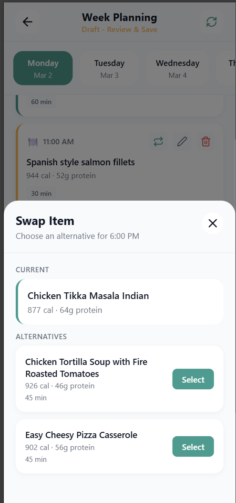
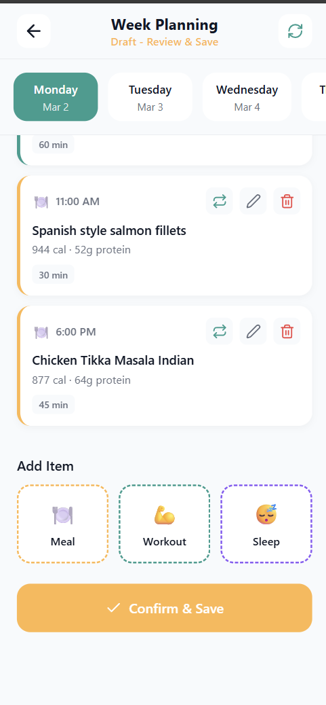

# Manual Test: Meal Test

**Date**: 03/07/2026

**Name of the person performing the test**: Emerson

**Test Steps**:

1. Logged in and Opened Sophros
2. Navigated to a new week
3. Clicked Plan Week
4. Navigate through Meal Plan Pages
5. Save Meal Plan

**Expected results**:
1. We can swap out meals with alternatives
2. We can save our meal plan

**Actual results**:
1. Meals could be swapped out
2. The save button didn't work, it just did nothing

**Outcome (pass/fail)**: Fail

**Logs/screenshots/evidence**:

**Next steps as required**:
Investigate the cause of this bug. Why can the meals not be saved?
