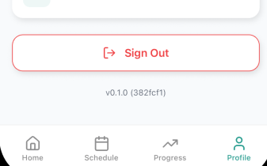

# Manual Test: Version Identifier Display on Profile Page

**Date**: 2026-03-11

**Name of the person performing the test**: Eduard Tanase

**Test Steps**:

1. Build and run the app on a device or simulator
2. Navigate to the **Profile** tab
3. Scroll to the bottom of the Profile screen
4. Observe the version string displayed below the Sign Out button

**Expected results**:

- A version string in the format `v<semver> (<short-git-hash>)` is visible at the bottom of the Profile screen (e.g. `v0.1.0 (382fcf1)`)
- The semver portion matches the latest git tag (or falls back to the version in `package.json`)
- The short commit hash matches the HEAD commit of the current build

**Actual results**:

- Version string `v0.1.0 (382fcf1)` is displayed correctly at the bottom of the Profile screen below the Sign Out button

**Outcome (pass/fail)**: Pass

**Logs/screenshots/evidence**:

**Next steps as required**:

- N/A
