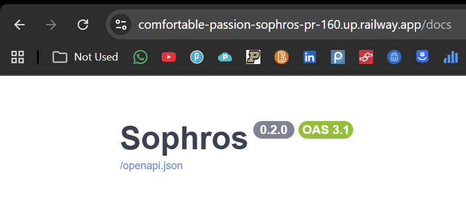

# Manual Test: Railway Backend Deployment

**Date**: 2026-03-15

**Name of the person performing the test**: Emerson Maddock

**Test Steps**:

1. Push to a branch and open PR against `main`
    a. Ensure that PR deployments enabled in the Railway service settings (Settings → Source → PR Deployments)
2. Automatically Railway triggers a build from the Dockerfile, displayed in PR
5. Set all required environment variables in the Railway service dashboard (`DATABASE_URL`, `CLERK_*`, `OPENAI_API_KEY`, `SPOONACULAR_API_KEY`)
6. Wait for the build and deployment to complete
7. Hit the `/health` endpoint on the Railway-provided URL

**Expected results**:

- Railway builds the Docker image successfully using `backend/Dockerfile`
- Alembic migrations run without error on startup
- The `/health` endpoint returns `{"status": "ok", "project": "Sophros"}`
- The `/docs` endpoint serves the OpenAPI UI

**Actual results**:

- Railway successfully built and deployed the backend service using the Dockerfile
- Server launched and responded correctly

**Outcome (pass/fail)**: Pass

**Logs/screenshots/evidence**:

**Next steps as required**:

- Configure production environment variables in the Railway production service
