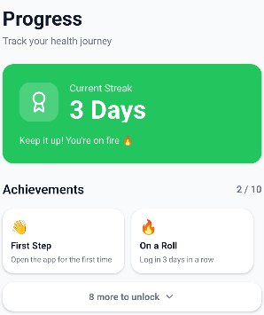
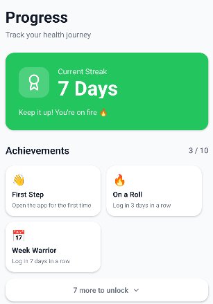

# Manual Test: Achievements

**Date**: 4/26/2026

**Name of the person performing the test**: Emerson Maddock

**Test Steps**:

1. Make a new account
2. Immediately go to the achievements page, check against expectation
3. Generate a meal plan
4. Use dev tool to jump into the future, day by day to increase the streak
5. Check achievements against expectation

**Expected results**:
Expect that only "First Step" is confirmed (from Step 2)
Expect that "On a Roll" and "Week Warrior" are added after a week(from Step 5)

**Actual results**:
Matched Expected Results

**Outcome (pass/fail)**:
Pass

**Logs/screenshots/evidence**:

**Next steps as required**:
The rest of the achievements need to be validated, with future features like sharing your achievements as well.
